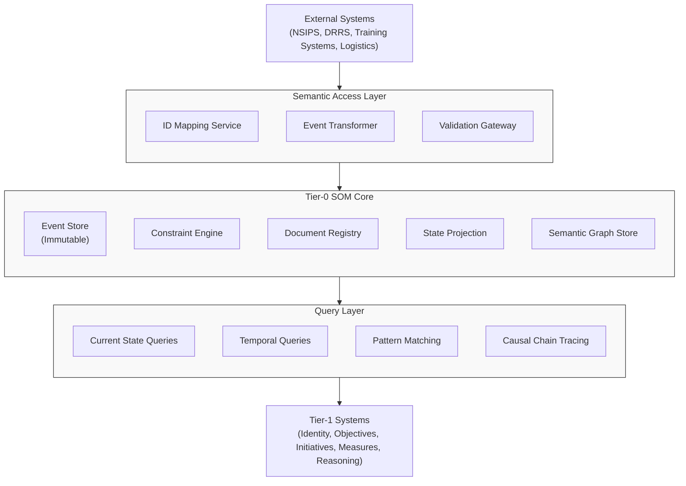

# Digital Backbone (Semantic Operating Model)

**Tier-0 Semantic Operating Model for NSW** - An authoritative conceptual representation that provides a shared, computable model of organizational structure, behavior, intent, and constraints.

> **Note**: This project is a **Monorepo**. Active development occurs in the `apps/` and `packages/` workspaces.

---

## Project Structure

The project is organized into workspaces managed by npm:

- **`apps/som-tier0`**: The core Tier-0 Semantic Operating Model application (source code in `apps/som-tier0/src`).
- **`apps/how-do`**: Operational process definition and execution tool.
- **`apps/policy-governance`**: Editor for Policy documents and constraints.
- **`apps/org-chart`**: interactive Organization, Position, and Person visualizer.
- **`apps/task-management`**: Task and Initiative management interface.
- **`apps/objectives-okr`**: Strategy dashboard for Objectives and Key Results.
- **`packages/som-shared-types`**: Shared TypeScript type definitions and interfaces.


## Overview

The Semantic Operating Model (SOM) is a graph-based semantic layer that provides a unified, computable representation of organizational structure, behavior, intent, and constraints. It serves as an interpretation layer above existing systems of record, mapping disparate data sources into a coherent semantic graph that enables causal reasoning, temporal queries, and constraint-based governance.

### Core Primitives

The SOM is built on three fundamental primitives:

- **Holons**: Persistent entities with stable identities (Person, Position, Organization, Mission, Capability, Asset, Qualification, Objective, LOE, Initiative, Task, Document, etc.)
- **Relationships**: First-class connections between holons with their own properties and lifecycles
- **Events**: Immutable change records that capture all state transitions over time

## Architecture

### High-Level Components



## Getting Started

### Installation

Install dependencies for all workspaces from the root:

```bash
npm install
```

### Building

Build all workspaces:

```bash
npm run build
```

### Testing

Run tests across all workspaces:

```bash
```bash
npm run test
```

### Governance (Linting)

Run the semantic linter to verify architectural compliance:

```bash
npm run lint:semantic
```

## detailed System Capabilities

### Key Features

- **Event Sourcing**: All state is derived from an immutable event log, enabling complete auditability and temporal reconstruction.
- **Temporal Queries**: Query the state of any holon or relationship at any point in time (as-of queries).
- **Constraint Validation**: Document-grounded constraints ensure structural integrity and policy compliance.
- **Semantic Interoperability**: Semantic Access Layer maps external system data to SOM semantics.
- **Causal Reasoning**: Trace causal chains through event links to understand what led to current states.

### Core Components

1. **Event Store**: Append-only immutable log of all state changes
2. **State Projection Engine**: Derives current holon and relationship states from events
3. **Semantic Graph Store**: Materialized view of current holons and relationships
4. **Constraint Engine**: Validates events and state changes against document-grounded rules
5. **Document Registry**: Manages authoritative documents and their effective dates
6. **Semantic Access Layer**: Maps external system data to SOM semantics
7. **Query Layer**: Provides current state, temporal, and pattern matching queries
8. **API Layer**: REST API for Tier-1 system integration

## Developer Guide

### Testing Strategy

The project uses a dual testing approach:
1. **Unit Tests**: Verify specific examples, edge cases, and error conditions.
2. **Property-Based Tests**: Verify universal properties across all inputs using fast-check.

### API Usage

The SOM provides a REST API for Tier-1 system integration.

**Example: Temporal query (as-of)**
```bash
POST /api/v1/temporal/holons
{
  "type": "Organization",
  "asOfTimestamp": "2023-12-31T23:59:59Z",
  "includeRelationships": true
}
```

## Documentation

For more specific details, please refer to the documentation within the workspaces:
- [Tier-0 SOM Application](apps/som-tier0/README.md)
- [Shared Types](packages/som-shared-types/README.md) (if available)
- [Design Documentation](docs/design/system_architecture.md)
- [Product Specifications](docs/product_specs.md)


## License

MIT
