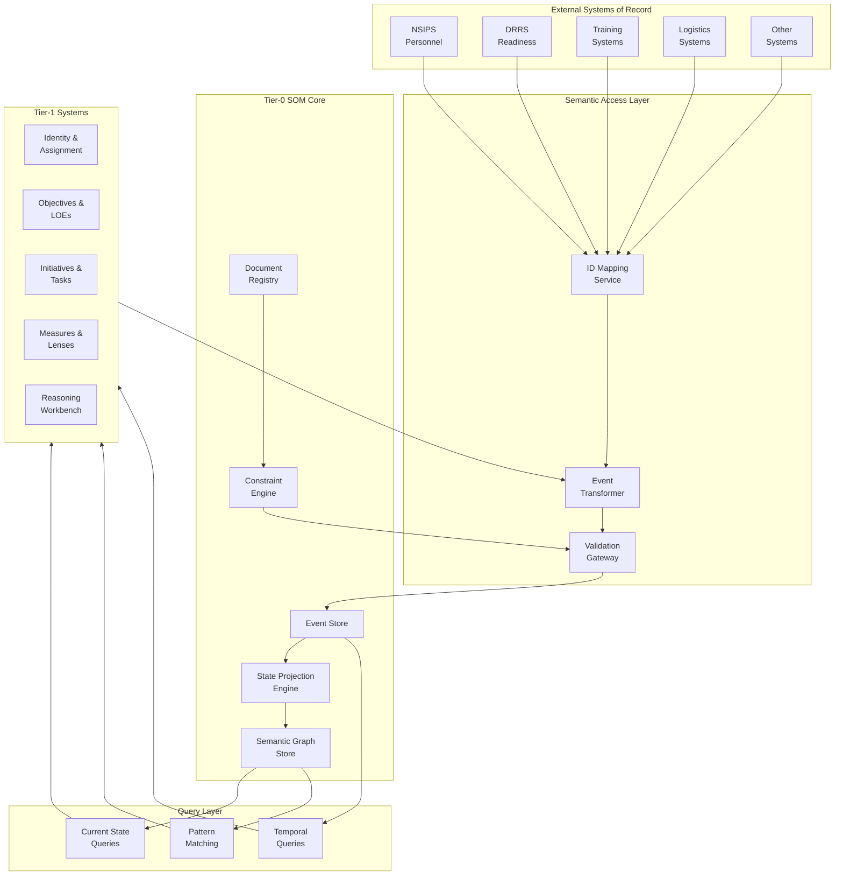

# Design Document

## Overview

The Tier-0 Semantic Operating Model (SOM) is a graph-based semantic layer that provides a unified, computable representation of NSW's organizational structure, behavior, intent, and constraints. The system is built on three core primitives: holons (persistent entities), relationships (first-class connections), and events (immutable change records). The SOM serves as an interpretation layer above existing systems of record, mapping disparate data sources into a coherent semantic graph that enables causal reasoning, temporal queries, and constraint-based governance.

The architecture follows an event-sourced design where all state is derived from an immutable event log. This enables complete auditability, temporal queries (as-of any timestamp), and causal chain analysis. The system enforces structural integrity through document-grounded constraints that validate all state changes before acceptance.

## Architecture

### High-Level Architecture



### Core Components

1. **Event Store**: Immutable append-only log of all state changes
2. **State Projection Engine**: Derives current holon and relationship states from events
3. **Semantic Graph Store**: Materialized view of current holons and relationships
4. **Constraint Engine**: Validates events and state changes against document-grounded rules
5. **Document Registry**: Manages authoritative documents and their effective dates
6. **Semantic Access Layer**: Maps external system data to SOM semantics
7. **Query Layer**: Provides current state, temporal, and pattern matching queries

## Components and Interfaces

### 1. Holon Management

**Purpose**: Create, update, and query persistent entities (holons) with stable identities.

**Interface**:
```
createHolon(type, properties, sourceDocument) -> HolonID
getHolon(holonID) -> Holon
getHolonsByType(type, filters) -> List<Holon>
markHolonInactive(holonID, reason, sourceDocument) -> Event
getHolonHistory(holonID) -> List<Event>
```

**Implementation Notes**:
- Each holon type (Person, Position, Organization, etc.) has a schema defining required and optional properties
- Holon IDs are UUIDs generated at creation time and never reused
- Holons are never deleted; inactive holons remain queryable with historical data
- All holon modifications generate events that flow through the constraint engine

### 2. Relationship Management

**Purpose**: Create and manage first-class relationships between holons with their own properties and lifecycles.

**Interface**:
```
createRelationship(type, sourceHolonID, targetHolonID, properties, effectiveDates) -> RelationshipID
getRelationship(relationshipID) -> Relationship
getRelationshipsFrom(holonID, relationshipType) -> List<Relationship>
getRelationshipsTo(holonID, relationshipType) -> List<Relationship>
endRelationship(relationshipID, endDate, reason) -> Event
```

**Implementation Notes**:
- Relationships have directionality (source -> target) and multiplicity constraints
- Each relationship type defines validation rules (e.g., Person OCCUPIES Position requires qualification match)
- Relationships have effective start/end dates for temporal queries
- Relationship formation triggers constraint validation before acceptance

### 3. Event Management

**Purpose**: Record all state changes as immutable events and provide event replay capabilities.

**Interface**:
```
submitEvent(eventType, actor, subjects, payload, sourceSystem, sourceDocument) -> EventID
getEvent(eventID) -> Event
getEventsByHolon(holonID, timeRange) -> List<Event>
getEventsByType(eventType, timeRange) -> List<Event>
replayEvents(holonID, asOfTimestamp) -> HolonState
```

**Implementation Notes**:
- Events are append-only and immutable
- Corrections use compensating events (e.g., AssignmentCorrected)
- Events include causal links (CAUSED_BY, FOLLOWS, GROUPED_WITH)
- Event validation occurs before acceptance; invalid events are rejected with detailed errors

### 4. Constraint Engine

**Purpose**: Validate holons, relationships, and events against document-grounded constraints.

**Interface**:
```
validateEvent(event) -> ValidationResult
validateRelationship(relationship) -> ValidationResult
validateHolon(holon) -> ValidationResult
getApplicableConstraints(holonType, timestamp) -> List<Constraint>
registerConstraint(constraint, sourceDocument) -> ConstraintID
```

**Implementation Notes**:
- Constraints are typed: Structural, Policy, Eligibility, Temporal, Capacity, Dependency, Risk
- Each constraint links to a defining document
- Constraints can be inherited down hierarchies with explicit precedence rules
- Validation uses constraints in force at the event timestamp

### 5. Document Registry

**Purpose**: Manage authoritative documents that define semantics, constraints, and measures.

**Interface**:
```
registerDocument(title, type, version, effectiveDates, content) -> DocumentID
getDocument(documentID) -> Document
getDocumentsInForce(timestamp) -> List<Document>
supersede(oldDocumentID, newDocumentID) -> Event
getDefinedBy(holonType | constraintID | measureID) -> List<Document>
```

**Implementation Notes**:
- Documents have effective date ranges
- Supersession relationships form a version chain
- All holon types, constraints, measures, and lenses must reference at least one document
- Temporal queries use documents in force at the query timestamp

### 6. Semantic Access Layer

**Purpose**: Map external system data to SOM holons and events, providing semantic interoperability.

**Interface**:
```
mapExternalID(externalSystem, externalID) -> HolonID
submitExternalData(externalSystem, data) -> List<Event>
queryForSystem(externalSystem, query) -> SystemSpecificFormat
resolveConflicts(conflictingData) -> Resolution
```

**Implementation Notes**:
- Maintains bidirectional mappings between external IDs and SOM holon IDs
- Transforms system-specific data formats into SOM events
- Applies precedence rules from documents to resolve conflicts
- Provides system-appropriate views of the semantic graph

### 7. Temporal Query Engine

**Purpose**: Support as-of queries and historical state reconstruction.

**Interface**:
```
getHolonAsOf(holonID, timestamp) -> HolonState
getRelationshipsAsOf(holonID, timestamp) -> List<Relationship>
getOrganizationStructureAsOf(orgID, timestamp) -> OrgTree
traceEventChain(eventID) -> CausalChain
```

**Implementation Notes**:
- Replays events from the event store up to the specified timestamp
- Caches common as-of states for performance
- Supports time-range queries for event analysis
- Provides causal chain tracing through event links

### 8. Measure and Lens Engine

**Purpose**: Define, compute, and evaluate measures and lenses for performance and health assessment.

**Interface**:
```
defineMeasure(name, unit, calculationMethod, sourceDocument) -> MeasureDefinitionID
defineLens(name, inputMeasures, logic, outputs, sourceDocument) -> LensDefinitionID
emitMeasure(measureDefinitionID, value, holonID, timestamp) -> Event
evaluateLens(lensDefinitionID, holonID, timestamp) -> LensOutput
getMeasureHistory(measureDefinitionID, holonID, timeRange) -> List<MeasureValue>
```

**Implementation Notes**:
- Measures can be state (snapshot) or flow (rate), leading or lagging
- Lenses combine multiple measures using defined logic and thresholds
- Both measures and lenses are versioned; changes create new versions
- Lens outputs are traceable to input measures and computation rules

## Data Models

### Core Holon Types

```typescript
interface Holon {
  id: HolonID;
  type: HolonType;
  properties: Record<string, any>;
  createdAt: Timestamp;
  createdBy: Event;
  status: 'active' | 'inactive';
  sourceDocuments: DocumentID[];
}

enum HolonType {
  Person,
  Position,
  Organization,
  System,
  Asset,
  Mission,
  Capability,
  Qualification,
  Event,
  Location,
  Document,
  Objective,
  LOE,
  Initiative,
  Task,
  MeasureDefinition,
  LensDefinition,
  Constraint
}

interface Person extends Holon {
  type: HolonType.Person;
  properties: {
    edipi: string;
    serviceNumbers: string[];
    name: string;
    dob: Date;
    serviceBranch: string;
    designatorRating: string;
    category: 'active_duty' | 'reserve' | 'civilian' | 'contractor';
  };
}

interface Position extends Holon {
  type: HolonType.Position;
  properties: {
    billetIDs: string[];
    title: string;
    gradeRange: { min: string; max: string };
    designatorExpectations: string[];
    criticality: 'critical' | 'important' | 'standard';
    billetType: 'command' | 'staff' | 'support';
  };
}

interface Organization extends Holon {
  type: HolonType.Organization;
  properties: {
    uics: string[];
    name: string;
    type: string;
    echelonLevel: string;
    missionStatement: string;
  };
}

interface Mission extends Holon {
  type: HolonType.Mission;
  properties: {
    operationName: string;
    operationNumber: string;
    type: 'training' | 'real_world';
    classificationMetadata: string;
    startTime: Timestamp;
    endTime: Timestamp;
  };
}

interface Capability extends Holon {
  type: HolonType.Capability;
  properties: {
    capabilityCode: string;
    name: string;
    description: string;
    level: 'strategic' | 'operational' | 'tactical';
    domain: string;
  };
}

interface Qualification extends Holon {
  type: HolonType.Qualification;
  properties: {
    nec?: string;
    pqsID?: string;
    courseCode?: string;
    certificationID?: string;
    name: string;
    type: string;
    validityPeriod: Duration;
    renewalRules: string;
    issuingAuthority: string;
  };
}

interface Objective extends Holon {
  type: HolonType.Objective;
  properties: {
    description: string;
    level: 'strategic' | 'operational' | 'tactical';
    timeHorizon: Date;
    status: 'proposed' | 'approved' | 'active' | 'achieved' | 'abandoned' | 'revised';
  };
}

interface LOE extends Holon {
  type: HolonType.LOE;
  properties: {
    name: string;
    description: string;
    sponsoringEchelon: string;
    timeframe: { start: Date; end: Date };
  };
}

interface Initiative extends Holon {
  type: HolonType.Initiative;
  properties: {
    name: string;
    scope: string;
    sponsor: string;
    targetOutcomes: string[];
    stage: 'proposed' | 'approved' | 'planned' | 'active' | 'paused' | 'completed' | 'cancelled';
  };
}

interface Task extends Holon {
  type: HolonType.Task;
  properties: {
    description: string;
    type: string;
    priority: 'critical' | 'high' | 'medium' | 'low';
    dueDate: Date;
    status: 'created' | 'assigned' | 'started' | 'blocked' | 'completed' | 'cancelled';
  };
}
```

### Relationship Model

```typescript
interface Relationship {
  id: RelationshipID;
  type: RelationshipType;
  sourceHolonID: HolonID;
  targetHolonID: HolonID;
  properties: Record<string, any>;
  effectiveStart: Timestamp;
  effectiveEnd?: Timestamp;
  sourceSystem: string;
  sourceDocuments: DocumentID[];
  createdBy: EventID;
  authorityLevel: 'authoritative' | 'derived' | 'inferred';
  confidenceScore?: number;
}

enum RelationshipType {
  // Structural
  CONTAINS,
  HAS,
  OCCUPIES,
  MEMBER_OF,
  BELONGS_TO,
  PART_OF,
  
  // Responsibility
  RESPONSIBLE_FOR,
  OWNED_BY,
  OPERATED_BY,
  
  // Alignment
  GROUPED_UNDER,
  ALIGNED_TO,
  
  // Support
  SUPPORTS,
  ENABLES,
  USES,
  
  // Qualification
  HELD_BY,
  REQUIRED_FOR,
  
  // Governance
  DEFINES,
  AUTHORIZES,
  SUPERSEDES,
  DERIVED_FROM,
  
  // Temporal/Causal
  CAUSED_BY,
  FOLLOWS,
  GROUPED_WITH,
  
  // Location
  LOCATED_AT,
  HOSTS,
  STAGING_FOR,
  OCCURS_AT,
  
  // Work
  ASSIGNED_TO,
  PARTICIPATES_IN,
  PRODUCES,
  DEPENDS_ON,
  
  // Measurement
  MEASURED_BY,
  EMITS_MEASURE,
  GROUNDED_IN,
  AFFECTS,
  APPLIES_TO
}
```

### Event Model

```typescript
interface Event {
  id: EventID;
  type: EventType;
  occurredAt: Timestamp;
  recordedAt: Timestamp;
  actor: HolonID; // Person, Position, or System
  subjects: HolonID[]; // Holons or Relationships affected
  payload: Record<string, any>;
  sourceSystem: string;
  sourceDocument?: DocumentID;
  validityWindow?: { start: Timestamp; end: Timestamp };
  causalLinks: {
    precededBy?: EventID[];
    causedBy?: EventID[];
    groupedWith?: EventID[];
  };
}

enum EventType {
  // Structural
  OrganizationCreated,
  OrganizationRealigned,
  OrganizationDeactivated,
  PositionCreated,
  PositionModified,
  PositionDeactivated,
  
  // Assignment
  AssignmentStarted,
  AssignmentEnded,
  AssignmentCorrected,
  
  // Qualification
  QualificationAwarded,
  QualificationRenewed,
  QualificationExpired,
  QualificationRevoked,
  
  // Mission
  MissionPlanned,
  MissionApproved,
  MissionLaunched,
  MissionPhaseTransition,
  MissionCompleted,
  MissionDebriefed,
  
  // System/Asset
  SystemDeployed,
  SystemUpdated,
  SystemOutage,
  SystemDeprecated,
  AssetMaintenance,
  AssetFailure,
  AssetUpgrade,
  
  // Objective/LOE
  ObjectiveCreated,
  ObjectiveRescoped,
  ObjectiveClosed,
  LOECreated,
  LOEReframed,
  
  // Initiative/Task
  InitiativeStageChange,
  TaskCreated,
  TaskAssigned,
  TaskStarted,
  TaskBlocked,
  TaskCompleted,
  TaskCancelled,
  
  // Governance
  DocumentIssued,
  DocumentUpdated,
  DocumentRescinded,
  ConstraintViolation,
  
  // Measurement
  MeasureEmitted,
  LensEvaluated
}
```

### Constraint Model

```typescript
interface Constraint {
  id: ConstraintID;
  type: ConstraintType;
  name: string;
  definition: string;
  scope: {
    holonTypes?: HolonType[];
    relationshipTypes?: RelationshipType[];
    eventTypes?: EventType[];
  };
  effectiveDates: { start: Date; end?: Date };
  sourceDocuments: DocumentID[];
  validationLogic: ValidationFunction;
  precedence: number;
  inheritanceRules?: InheritanceRule;
}

enum ConstraintType {
  Structural,
  Policy,
  Eligibility,
  Temporal,
  Capacity,
  Dependency,
  Risk
}

interface ValidationResult {
  valid: boolean;
  errors?: ValidationError[];
  warnings?: ValidationWarning[];
}

interface ValidationError {
  constraintID: ConstraintID;
  message: string;
  violatedRule: string;
  affectedHolons: HolonID[];
}
```

### Document Model

```typescript
interface Document {
  id: DocumentID;
  referenceNumbers: string[];
  title: string;
  type: DocumentType;
  version: string;
  effectiveDates: { start: Date; end?: Date };
  classificationMetadata: string;
  content?: string;
  supersedes?: DocumentID[];
  derivedFrom?: DocumentID[];
}

enum DocumentType {
  Policy,
  Order,
  Plan,
  SOP,
  Record,
  Instruction,
  Manual,
  Charter,
  Framework,
  CONOPS,
  OPLAN,
  EXORD
}
```

### Measure and Lens Models

```typescript
interface MeasureDefinition {
  id: MeasureDefinitionID;
  name: string;
  description: string;
  unit: string;
  calculationMethod: string;
  samplingFrequency: Duration;
  dataSources: string[];
  type: 'state' | 'flow';
  leadingOrLagging: 'leading' | 'lagging';
  quantitativeOrQualitative: 'quantitative' | 'qualitative';
  version: number;
  sourceDocuments: DocumentID[];
}

interface LensDefinition {
  id: LensDefinitionID;
  name: string;
  description: string;
  inputMeasures: MeasureDefinitionID[];
  logic: string; // Computation rules
  thresholds: Record<string, any>;
  outputs: string[]; // e.g., ['green', 'amber', 'red']
  version: number;
  sourceDocuments: DocumentID[];
}

interface MeasureValue {
  measureDefinitionID: MeasureDefinitionID;
  value: number | string;
  holonID?: HolonID;
  eventID?: EventID;
  timestamp: Timestamp;
  confidence?: number;
}

interface LensOutput {
  lensDefinitionID: LensDefinitionID;
  output: string;
  inputValues: MeasureValue[];
  holonID: HolonID;
  timestamp: Timestamp;
  explanation: string;
}
```


## Correctness Properties

*A property is a characteristic or behavior that should hold true across all valid executions of a system—essentially, a formal statement about what the system should do. Properties serve as the bridge between human-readable specifications and machine-verifiable correctness guarantees.*

### Property 1: Holon ID uniqueness and persistence

*For any* holon created in the SOM, the assigned SOM ID must be unique across all holons and must never change regardless of system migrations or state changes.
**Validates: Requirements 1.1**

### Property 2: External ID mapping consistency

*For any* external system ID, mapping it to a SOM holon ID must always return the same holon ID across multiple mapping operations.
**Validates: Requirements 1.2, 13.1**

### Property 3: Holon query completeness

*For any* holon, querying it must return all required fields: identity, purpose, properties, relationships, lifecycle state, and document lineage.
**Validates: Requirements 1.3**

### Property 4: Inactive holon preservation

*For any* holon marked inactive, the holon and its complete event history must remain queryable and unchanged.
**Validates: Requirements 1.4, 5.4**

### Property 5: Temporal query round-trip

*For any* holon state at timestamp T, querying as-of T after subsequent modifications must return the original state at T.
**Validates: Requirements 1.5, 3.5, 14.1**

### Property 6: Relationship completeness

*For any* relationship created, it must have a unique ID, directionality, multiplicity constraints, effective dates, and provenance metadata.
**Validates: Requirements 2.1**

### Property 7: Relationship constraint enforcement

*For any* relationship that violates eligibility, capacity, or policy constraints, the SOM must reject its creation.
**Validates: Requirements 2.2, 2.5, 4.3**

### Property 8: Relationship change event generation

*For any* relationship modification, an event must be created with complete source document and system provenance.
**Validates: Requirements 2.3**

### Property 9: Relationship temporal reconstruction

*For any* relationship graph at timestamp T, querying as-of T after subsequent changes must reconstruct the exact graph at T.
**Validates: Requirements 2.4, 14.2**

### Property 10: Event immutability

*For any* event in the event store, it must never be modified; corrections must be made via new compensating events.
**Validates: Requirements 3.3**

### Property 11: Event completeness

*For any* state change, the generated event must contain event ID, type, timestamp, actor, subjects, payload, source system, and source document.
**Validates: Requirements 3.1**

### Property 12: Event pre-validation

*For any* event that violates constraints, the SOM must reject it before it enters the event store.
**Validates: Requirements 3.2, 4.4, 15.1**

### Property 13: State derivation from events

*For any* sequence of events, folding them in time order must produce the correct current state of all affected holons and relationships.
**Validates: Requirements 3.4**

### Property 14: Constraint document linkage

*For any* constraint, it must be linked to at least one defining document with complete metadata.
**Validates: Requirements 4.1**

### Property 15: Holon constraint validation

*For any* holon creation or modification that violates applicable constraints, the SOM must reject the operation.
**Validates: Requirements 4.2**

### Property 16: Constraint inheritance

*For any* holon in a hierarchy with inherited constraints, the SOM must apply inherited constraints with correct precedence for overrides.
**Validates: Requirements 4.5**

### Property 17: Person holon completeness

*For any* Person holon created, it must contain SOM Person ID, EDIPI, service numbers, and demographics.
**Validates: Requirements 5.1**

### Property 18: Assignment qualification validation

*For any* Person OCCUPIES Position relationship where the person lacks required qualifications or grade, the SOM must reject the assignment.
**Validates: Requirements 5.2, 6.5**

### Property 19: Qualification change tracking

*For any* qualification gained or lost by a person, a qualification event must be recorded and the Person HAS_QUAL relationship must be updated.
**Validates: Requirements 5.3**

### Property 20: Concurrent position constraint enforcement

*For any* person with multiple concurrent positions, the SOM must enforce maximum concurrent position constraints by type.
**Validates: Requirements 5.5**

### Property 21: Position holon completeness

*For any* Position holon created, it must contain SOM Position ID, title, grade range, required qualifications, and criticality.
**Validates: Requirements 6.1**

### Property 22: Organization holon completeness

*For any* Organization holon created, it must contain SOM Organization ID, UIC, type, and parent organization reference.
**Validates: Requirements 6.2**

### Property 23: Organizational hierarchy validity

*For any* set of Organization CONTAINS Organization relationships, they must form a valid tree structure without cycles.
**Validates: Requirements 6.4**

### Property 24: Mission holon completeness

*For any* Mission holon created, it must contain SOM Mission ID, name, type, classification metadata, and time bounds.
**Validates: Requirements 7.1**

### Property 25: Mission lifecycle tracking

*For any* mission with phase transitions, all phase transition events must be recorded and mission state must reflect the current phase.
**Validates: Requirements 7.5**

### Property 26: Qualification holon completeness

*For any* Qualification holon created, it must contain SOM Qualification ID, identifier (NEC/PQS/course code), validity period, and renewal rules.
**Validates: Requirements 8.1**

### Property 27: Qualification expiration handling

*For any* qualification that expires, an expiration event must be recorded and the relationship validity window must be updated.
**Validates: Requirements 8.3**

### Property 28: Objective validation

*For any* Objective holon created without at least one measure, one owner, and one LOE link, the SOM must reject the creation.
**Validates: Requirements 9.4**

### Property 29: Initiative holon completeness

*For any* Initiative holon created, it must contain SOM Initiative ID, name, scope, sponsor, and stage.
**Validates: Requirements 10.1**

### Property 30: Task holon completeness

*For any* Task holon created, it must contain SOM Task ID, description, type, priority, due date, and status.
**Validates: Requirements 10.2**

### Property 31: Dependency relationship validity

*For any* set of DEPENDS_ON relationships among tasks or initiatives, they must form a directed acyclic graph without cycles.
**Validates: Requirements 10.5**

### Property 32: Measure definition completeness

*For any* MeasureDefinition holon created, it must contain name, description, unit, calculation method, and sampling frequency.
**Validates: Requirements 11.1**

### Property 33: Lens definition completeness

*For any* LensDefinition holon created, it must contain inputs, logic, thresholds, and outputs.
**Validates: Requirements 11.2**

### Property 34: Measure emission event generation

*For any* measure emitted, a measure emission event must be created with links to the relevant holon or event.
**Validates: Requirements 11.3**

### Property 35: Lens evaluation correctness

*For any* lens evaluation, the output must be correctly computed from input measures according to the lens logic.
**Validates: Requirements 11.4**

### Property 36: Definition versioning

*For any* measure or lens definition change, a new version must be created while preserving the old version for historical queries.
**Validates: Requirements 11.5, 17.4**

### Property 37: Document holon completeness

*For any* Document holon created, it must contain SOM Document ID, reference numbers, title, type, version, and effective dates.
**Validates: Requirements 12.1**

### Property 38: Document temporal validity

*For any* timestamp T, querying documents in force at T must return only documents whose effective date ranges include T.
**Validates: Requirements 12.5**

### Property 39: External data transformation

*For any* external system data submitted, the Semantic Access Layer must transform it into valid SOM events that pass constraint validation.
**Validates: Requirements 13.2**

### Property 40: Multi-system entity consistency

*For any* entity referenced by multiple external systems, all references must map to the same SOM holon ID.
**Validates: Requirements 13.5**

### Property 41: Causal chain traversal

*For any* event with causal links, following the links must produce a valid causal chain showing what led to the event.
**Validates: Requirements 14.3**

### Property 42: Audit completeness

*For any* holon or relationship, querying its event history must return all events that affected it in chronological order.
**Validates: Requirements 14.4**

### Property 43: Validity window respect

*For any* event with a validity window, as-of queries outside that window must not include the event's effects.
**Validates: Requirements 14.5**

### Property 44: Validation error reporting

*For any* event that fails validation, the error response must include which constraints were violated and detailed error information.
**Validates: Requirements 15.2**

### Property 45: Temporal constraint validation

*For any* event submitted at timestamp T, validation must use the constraints and documents in force at T.
**Validates: Requirements 15.4**

### Property 46: Batch atomicity

*For any* batch of events containing at least one invalid event, the entire batch must be rejected and no events from the batch must be stored.
**Validates: Requirements 15.5**

### Property 47: Query completeness by type

*For any* holon type, querying all holons of that type must return every holon of that type with complete properties and relationships.
**Validates: Requirements 16.1**

### Property 48: Bidirectional relationship traversal

*For any* relationship, it must be queryable from both the source holon and the target holon.
**Validates: Requirements 16.2**

### Property 49: Schema version assignment

*For any* schema change, the SOM must assign a major version for breaking changes and a minor version for non-breaking changes.
**Validates: Requirements 17.1**

### Property 50: Type collision detection

*For any* new holon or relationship type proposed, the SOM must validate it against existing types and reject if collisions are detected.
**Validates: Requirements 17.3**

### Property 51: Schema proposal completeness

*For any* new holon type proposed, it must include reference documents, example use cases, and collision analysis.
**Validates: Requirements 18.1**

### Property 52: Role-based access enforcement

*For any* query with a specific role, the SOM must return only holons and relationships that the role is authorized to access.
**Validates: Requirements 20.1**

### Property 53: Classification-based access control

*For any* document with classification metadata, holons and constraints defined by that document must be accessible only to users with appropriate clearance.
**Validates: Requirements 20.2**

### Property 54: Information hiding on access denial

*For any* query that includes restricted information, the SOM must return filtered results without revealing the existence of restricted data.
**Validates: Requirements 20.5**

## Error Handling

### Error Categories

1. **Validation Errors**: Constraint violations, missing required fields, invalid relationships
2. **Temporal Errors**: Invalid timestamps, events out of order, expired validity windows
3. **Authorization Errors**: Insufficient permissions, classification violations
4. **Consistency Errors**: Circular dependencies, orphaned relationships, conflicting events
5. **Integration Errors**: External system mapping failures, data transformation errors

### Error Handling Strategy

**Validation Errors**:
- Reject operations before state changes occur
- Return detailed error messages including violated constraints and affected holons
- Log validation failures for audit and analysis
- Provide suggestions for correction when possible

**Temporal Errors**:
- Validate event timestamps against system clock and event ordering
- Reject events with timestamps outside valid ranges
- Handle clock skew with configurable tolerance windows
- Support compensating events for temporal corrections

**Authorization Errors**:
- Enforce access controls at query and mutation boundaries
- Return filtered results without revealing restricted information
- Log authorization failures for security audit
- Provide clear error messages for permission issues

**Consistency Errors**:
- Detect cycles in hierarchical and dependency relationships
- Validate referential integrity before accepting events
- Provide tools for detecting and resolving inconsistencies
- Support manual override with explicit justification for edge cases

**Integration Errors**:
- Retry transient failures with exponential backoff
- Log mapping failures with source system context
- Provide dead letter queue for unprocessable external data
- Support manual reconciliation workflows for complex conflicts

### Error Recovery

- **Event Replay**: Reprocess events from a checkpoint to recover from state corruption
- **Compensating Events**: Correct errors by appending new events rather than modifying history
- **Manual Intervention**: Provide admin tools for resolving complex inconsistencies
- **Rollback**: Support rolling back to previous consistent state for critical failures

## Testing Strategy

### Unit Testing

Unit tests will verify specific behaviors of individual components:

- **Holon Management**: Test creation, querying, and inactivation of each holon type
- **Relationship Management**: Test relationship creation, validation, and temporal queries
- **Event Management**: Test event submission, validation, and replay
- **Constraint Engine**: Test constraint validation for each constraint type
- **Document Registry**: Test document registration, supersession, and temporal queries
- **Semantic Access Layer**: Test ID mapping, data transformation, and conflict resolution
- **Temporal Query Engine**: Test as-of queries and causal chain traversal
- **Measure and Lens Engine**: Test measure emission and lens evaluation

### Property-Based Testing

Property-based tests will verify universal properties across all inputs using a PBT library. Each test will run a minimum of 100 iterations with randomly generated inputs.

**PBT Library**: We will use **fast-check** for TypeScript/JavaScript implementation, which provides excellent support for complex data generation and shrinking.

**Test Configuration**:
- Minimum 100 iterations per property test
- Shrinking enabled to find minimal failing examples
- Seed-based reproducibility for debugging
- Timeout protection for long-running tests

**Property Test Organization**:
- Each correctness property will be implemented as a single property-based test
- Tests will be tagged with the format: `**Feature: semantic-operating-model, Property N: [property text]**`
- Tests will be co-located with the components they test
- Generators will be shared across tests for consistency

**Key Generators**:
- `genHolon(type)`: Generate valid holons of a specific type
- `genRelationship(type)`: Generate valid relationships
- `genEvent(type)`: Generate valid events
- `genConstraint(type)`: Generate valid constraints
- `genDocument()`: Generate valid documents
- `genTimestamp()`: Generate valid timestamps with ordering
- `genInvalidX()`: Generate invalid instances for negative testing

**Example Property Test Structure**:
```typescript
// **Feature: semantic-operating-model, Property 1: Holon ID uniqueness and persistence**
test('holon IDs are unique and persistent', () => {
  fc.assert(
    fc.property(
      fc.array(genHolon('Person'), { minLength: 2, maxLength: 100 }),
      (holons) => {
        const ids = holons.map(h => h.id);
        const uniqueIds = new Set(ids);
        return ids.length === uniqueIds.size; // All IDs are unique
      }
    ),
    { numRuns: 100 }
  );
});
```

### Integration Testing

Integration tests will verify interactions between components:

- **End-to-End Event Flow**: Submit external data through SAL, validate, store, and query
- **Temporal Consistency**: Create events, modify state, query as-of various timestamps
- **Constraint Enforcement**: Test constraint validation across holon, relationship, and event operations
- **Access Control**: Test role-based and classification-based access across query types
- **Schema Evolution**: Test schema versioning and migration paths

### Performance Testing

Performance tests will verify scalability and response times:

- **Event Ingestion Rate**: Measure events processed per second
- **Query Response Time**: Measure query latency for various query types
- **Temporal Query Performance**: Measure as-of query performance with large event histories
- **Graph Traversal Performance**: Measure relationship traversal performance with large graphs
- **Concurrent Access**: Measure system behavior under concurrent read/write load

### Test Data Strategy

- **Synthetic Data**: Generate realistic test data using property-based generators
- **Anonymized Production Data**: Use anonymized production data for integration testing (where available)
- **Edge Cases**: Explicitly test boundary conditions and edge cases
- **Temporal Scenarios**: Create test scenarios with complex temporal relationships

## Implementation Notes

### Technology Stack Considerations

**Event Store**:
- Consider EventStoreDB or Apache Kafka for event sourcing
- Requires strong ordering guarantees and replay capabilities
- Must support temporal queries efficiently

**Graph Store**:
- Consider Neo4j or Amazon Neptune for semantic graph storage
- Requires efficient relationship traversal and pattern matching
- Must support temporal queries and versioning

**Constraint Engine**:
- Consider rule engine like Drools or custom constraint validator
- Must support document-grounded constraint definitions
- Requires efficient validation with minimal latency

**Semantic Access Layer**:
- Consider API gateway pattern with transformation middleware
- Must support multiple external system protocols
- Requires robust error handling and retry logic

### Scalability Considerations

- **Event Partitioning**: Partition events by holon type or organization for parallel processing
- **Read Replicas**: Use read replicas for query workloads
- **Caching**: Cache frequently accessed holons and relationships
- **Materialized Views**: Pre-compute common query patterns
- **Async Processing**: Process non-critical events asynchronously

### Security Considerations

- **Encryption**: Encrypt sensitive data at rest and in transit
- **Audit Logging**: Log all access and modifications for security audit
- **Role-Based Access Control**: Implement fine-grained RBAC
- **Classification Handling**: Enforce classification-based access controls
- **API Security**: Use OAuth 2.0 or similar for API authentication

### Monitoring and Observability

- **Event Metrics**: Track event ingestion rate, validation failures, processing latency
- **Query Metrics**: Track query latency, cache hit rates, error rates
- **System Health**: Monitor event store, graph store, and constraint engine health
- **Business Metrics**: Track holon counts, relationship counts, constraint violations
- **Alerting**: Alert on validation failures, performance degradation, system errors
