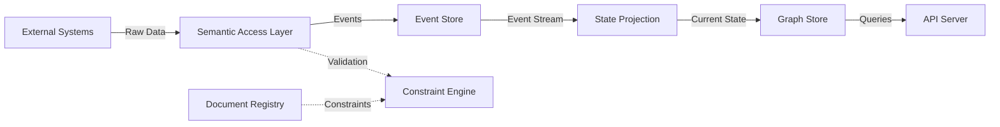

# System Architecture & Codebase Map

## System Overview
The **Semantic Operating Model (SOM)** Tier-0 is a graph-based semantic layer that provides a unified, computable representation of organizational structure, behavior, intent, and constraints. It acts as an interpretation layer above existing systems of record, mapping disparate data into a coherent semantic graph.

## Design Decisions

### 1. Event Sourcing
**Decision**: The system is built on an **immutable event log** as the single source of truth.
**Why**:
- **Auditability**: Every state change is recorded with provenance (who, when, why).
- **Temporal Queries**: Allows reconstructing the state of the system "as-of" any past timestamp.
- **Causal Reasoning**: Enables tracing chains of events (e.g., *this* assignment happened because *that* order was issued).

### 2. Graph-Based Data Model
**Decision**: Data is modeled as **Holons** (persistent entities) connected by **Relationships** (first-class edges).
**Why**:
- **Flexibility**: Relationships aren't hidden in foreign keys; they are explicit, typed, and have their own lifecycles.
- **Semantics**: Allows modeling complex, multi-dimensional connections (e.g., command, administrative, and functional chains of command simultaneously).

### 3. Document-Grounded Governance
**Decision**: All constraints and rules must be linked to an authoritative **Source Document** (e.g., a Policy or Order).
**Why**:
- **Traceability**: System behavior is directly traceable to human-readable governance.
- **Compliance**: Ensures that the system enforces actual organizational rules.

### 4. Semantic Access Layer (SAL)
**Decision**: An explicit translation layer maps external "System of Record" data to SOM semantics.
**Why**:
- **Interoperability**: Decouples the internal semantic model from the idiosyncratic schemas of external systems (NSIPS, DRRS, etc.).
- **Consistency**: Enforces SOM primitives and constraints on incoming dirty data.

## System Operation & Data Flow

1.  **Ingestion**: External data enters via the **Semantic Access Layer (SAL)**, which translates it into semantic Events.
2.  **Validation**: The **Constraint Engine** validates these events against rules defined by documents in the **Document Registry**.
3.  **Persistence**: Valid events are appended to the **Event Store** (the source of truth).
4.  **Projection**: The **State Projection Engine** replays events to derive the current state (Holons and Relationships).
5.  **Indexing**: The **Graph Store** indexes this projected state for fast querying.
6.  **Querying**: The **Query Layer** (via the API) serves requests for current state, historical state (via replay), or graph traversals.

## Codebase Map

### `apps/som-tier0/src`

#### Core Infrastructure
- **core**: Base interfaces (`IRepository`, `IEventStore`) and registry implementations.
- **api**: REST API server, route definitions, and DTOs.
- **integration.test.ts**: End-to-end integration tests.

#### Data & State Management
- **event-store**: Implements the immutable event log (`InMemoryEventStore`).
- **state-projection**: Logic to fold events into current state (`StateProjectionEngine`).
- **graph-store**: In-memory graph database for querying (`GraphStore`).
- **semantic-access-layer**: Transformers and adaptors for external data.

#### Logic & Governance
- **constraint-engine**: Rule validation engine.
- **governance**: Higher-level governance logic.
- **validation**: Shared validation utilities.
- **schema-registry**: JSON Schema storage and validation.
- **schema-versioning**: Data migration logic.

#### Domain Modules (Holon Management)
Each module manages the lifecycle and rules for a specific Holon Type:
- **person-management**: Person identities, demographics.
- **organization-management**: Positions, Org units, Hierarchies.
- **mission-management**: Operations, Missions, Phases.
- **initiative-task-management**: Initiatives, Tasks, Workflows.
- **objective-loe-management**: Objectives, Lines of Effort.
- **qualification-management**: Skills, Certifications, Requirements.
- **document-registry**: Document metadata and versioning.
- **measure-lens-engine**: Metrics and performance analysis.

### `packages/som-shared-types/src`
Shared definitions ensuring type safety across the monorepo.
- **event.ts**: `EventType` enums and `Event` interfaces.
- **holon.ts**: `HolonType` enums and specific Holon interfaces (Person, Position, etc.).
- **relationship.ts**: `RelationshipType` enums and interfaces.
