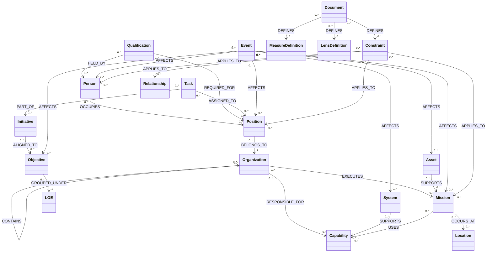

## I. Purpose of the Tier-0 Semantic Operating Model (SOM)

### 1. What the SOM *is*

The **Tier-0 Semantic Operating Model for NSW** is:

* **The authoritative conceptual representation of NSW as a system**

  * A shared, computable model of:

    * structure (who/what exists and how it is arranged)
    * behavior (what it does over time)
    * intent (what it is trying to achieve)
    * constraints (what it is allowed or required to do)

* **A graph of holons, relationships, and events**

  * **Holons**: persistent entities NSW cares about (Person, Position, Mission, Capability, System, etc.).
  * **Relationships**: first-class entities expressing how holons depend on, contain, or influence each other.
  * **Events**: immutable records of change over time (assignments, qualifications, system outages, mission phases, task completions).

* **A computable interpretation layer above data systems**

  * It does **not** store raw NSIPS rows, training table dumps, or SharePoint lists.
  * It defines how those data map into shared holons and events and how to interpret them.

* **The single shared language for enterprise systems**

  * Every Tier-1 system expresses:

    * who/what it touches → in terms of holons
    * what it does → in terms of events
    * what it means → in terms of constraints, measures, and lenses grounded in Documents.

* **The substrate for reasoning and governance**

  * Enables:

    * consistent measures of readiness, burden, risk, alignment
    * simulation and “what-if” reasoning
    * governance checks (policy, eligibility, capacity) before change is accepted
    * explainable decisions tied back to documents and events.

---

### 2. What the SOM *is not*

The SOM is **not**:

* **A UI or application**

  * No screens, no widgets, no user workflows. It is the model those apps sit on.

* **A workflow system**

  * It expresses *what* a task or process is and *what happened*, not *how to route the next approval step*.

* **A reporting environment**

  * Dashboards and reports consume SOM data. The SOM defines *meaning*, not visualizations.

* **An HR / readiness / training database**

  * Those remain systems of record. The SOM interprets them and connects them.

* **An ontology for its own sake**

  * Every definition must support real decisions, measurements, or controls.

* **A replacement for authoritative systems of record**

  * NSIPS, DRRS, training systems, logistics systems, etc., remain authoritative for their domains.
  * The SOM binds them into one coherent representation.

---

### 3. Why NSW needs this model

Without a Tier-0 SOM, NSW has:

* multiple incompatible mental models of “readiness,” “burden,” “risk,” “capacity”
* brittle point-to-point integrations between systems
* metrics and dashboards that cannot be reconciled or trusted
* decisions made on partial, misaligned views of reality.

The SOM enables:

* **Enterprise alignment**

  * Objectives, LOEs, initiatives, missions, and capabilities all share the same underlying objects.
  * Everyone is looking at the same structural picture, through different lenses.

* **Semantic interoperability**

  * NSIPS “billet”, DRRS “unit”, and a SharePoint “position record” all resolve to the same **Position** and **Organization** holons.
  * Different systems can talk about the same thing without schema-to-schema translation hell.

* **Causal reasoning**

  * Events connect missions, systems, people, capabilities, and constraints over time.
  * You can ask: *What structural changes led to this readiness dip?* and trace a chain of events and relationships.

* **Organizational memory**

  * Persistent holons and events create a traceable history:

    * who occupied which billet when
    * which systems supported which capabilities during which missions
    * how objectives, LOEs, and initiatives evolved.

* **Structural integrity**

  * Constraints ensure that:

    * only eligible people fill positions
    * missions don’t exceed capacity
    * initiatives align to Objectives and LOEs
    * semantics don’t drift per system.

* **Measurable progress**

  * Measures and lenses attach to holons and events in consistent ways.
  * You can evaluate:

    * progress on objectives
    * effect of initiatives
    * sustainability of workloads.

* **Cross-system coherence**

  * A single Person, Position, Mission, Capability graph underlies all Tier-1 systems.
  * No more “three different answers” depending on which tool you ask.

* **Event-driven interpretation of state**

  * State (“who is assigned where,” “system currently degraded,” “objective health: amber”) is derived from events, not manually reconciled snapshots.
  * You can reconstruct as-of state at any time.

---

## II. Mandatory Holon Types (Tier-0 Taxonomy)

### Shared template

For each holon:

* **Identity** – what makes it uniquely itself.
* **Purpose** – why NSW cares about this as a persistent unit.
* **Create when** – rules to instantiate a new instance.
* **Do *not* create when** – rules to avoid duplicates/noise.
* **Key properties** – stable attributes (not time-series).
* **Core relationships** – which other holons it links to.
* **Lifecycle** – how it comes into being, evolves, and ends.
* **Event interactions** – events that affect or reference it.
* **Constraints** – rules governing validity.
* **Document lineage** – which documents define or authorize it.
* **Temporal semantics** – how its meaning persists over time.
* **Nesting/alignment rules** – how it composes with others.

---

### 1. Person

* **Identity**

  * SOM Person ID
  * EDIPI, service number(s)
  * Name, DOB (cautiously used, policy constrained)

* **Purpose**

  * Represent a human being across all roles, assignments, qualifications, and systems.

* **Create when**

  * NSW must track an individual’s role, readiness, qualifications, or impact.
  * Person appears in any authoritative personnel system.

* **Do *not* create when**

  * Temporary visitors with no operational relevance.
  * Test/demo records.

* **Key properties**

  * Demographics (policy-limited)
  * Service branch, designator/rating, warfare quals summary
  * Active duty / reserve / civilian / contractor category

* **Core relationships**

  * `Person OCCUPIES Position`
  * `Person MEMBER_OF Organization` (e.g., command assignment)
  * `Person HAS_QUAL Qualification`
  * `Person PARTICIPATES_IN Mission/Task`
  * `Person LOCATED_AT Location` (current primary duty station)
  * `Person AFFECTED_BY Event` (e.g., injury, admin action)

* **Lifecycle**

  * Created on first authoritative appearance.
  * Accumulates history of assignments, quals, events.
  * Never deleted; may be marked *inactive* (e.g., separated, deceased).

* **Event interactions**

  * Assignment, promotion, PQS/qualification awarded/expired, training completed, casualty, legal/administrative actions.

* **Constraints**

  * Eligibility for positions, missions, qualifications (based on docs).
  * Max concurrent positions by type.

* **Document lineage**

  * Derived from personnel instructions, rating manuals, qual instructions, orders.

* **Temporal semantics**

  * Person persists across career; roles and capabilities change via events.

* **Nesting/alignment**

  * A Person never “contains” other holons but may be a **role holder** within nested Organizations, Missions, Initiatives.

---

### 2. Position (Billet)

* **Identity**

  * SOM Position ID
  * Billet ID(s) from NSIPS / command manning documents.

* **Purpose**

  * Represent a *role* in the structure that can be filled by a Person.

* **Create when**

  * A role is defined with sustained responsibility, tasks, or authority.

* **Do *not* create when**

  * One-off duty assignments that are better modeled as Tasks or temporary roles.

* **Key properties**

  * Title, grade range, designator/rating expectations, criticality, billet type (command, staff, support).

* **Core relationships**

  * `Position BELONGS_TO Organization`
  * `Position REQUIRES Qualification`
  * `Position RESPONSIBLE_FOR Capability / System / Objective`
  * `Position ALIGNED_TO LOE`
  * `Person OCCUPIES Position`

* **Lifecycle**

  * Created when an authorized billet is established.
  * Can be redefined, frozen, or deactivated via events.

* **Event interactions**

  * Position created/modified/deactivated; Person assignments; responsibility transfers.

* **Constraints**

  * Grade limits, required quals, max occupancy (usually 0 or 1), command manning constraints.

* **Document lineage**

  * Billet plans, manning documents, NEC/NOBC descriptions, command instructions.

* **Temporal semantics**

  * Position persists even if unfilled; history of who filled it when.

* **Nesting/alignment**

  * Positions roll up into Organizational structure; can be tagged to specific Missions, Systems, or Initiatives when designated.

---

### 3. Organization

* **Identity**

  * SOM Organization ID
  * UIC(s), equivalent identifiers.

* **Purpose**

  * Represent a unit or sub-organization as a structural node.

* **Create when**

  * Command, group, squadron, troop, detachment, center, department, etc., with defined purpose and authority.

* **Do *not* create when**

  * Short-lived working groups better modeled as Initiatives or Teams under an Organization.

* **Key properties**

  * Name, type (e.g., Echelon level, operational/support), parent org, mission statement short form.

* **Core relationships**

  * `Organization CONTAINS Organization` (hierarchy)
  * `Organization HAS Position`
  * `Organization EXECUTES Mission`
  * `Organization RESPONSIBLE_FOR Capability`
  * `Organization LOCATED_AT Location`
  * `Organization GOVERNED_BY Document`

* **Lifecycle**

  * Activated, realigned, deactivated via events.

* **Event interactions**

  * Organizational realignment, creation, deactivation, renaming, mission assignment changes.

* **Constraints**

  * Span of control thresholds, mandated roles, required capabilities.

* **Document lineage**

  * ROC/POE, OPLANs, organizational instructions, Navy admin orders.

* **Temporal semantics**

  * Org identity persists across name changes and realignments; relations change via events.

* **Nesting/alignment**

  * Hierarchical; can also participate in cross-cutting groups (e.g., functional working groups) via relationships.

---

### 4. System (Supertype)

Represents anything that behaves as a system for NSW: **Technical, Process, Coordination, Learning, Social/Cultural, Human, Physical/Equipment**.

* **Identity**

  * SOM System ID
  * External IDs (app ID, equipment serial, process ID, course number).

* **Purpose**

  * Represent systems that transform inputs to outputs under constraints.

* **Create when**

  * NSW deliberately depends on it to perform mission, support, or governance work.

* **Do *not* create when**

  * Transient tools that do not materially affect outcomes.

* **Key properties**

  * Type (technical/process/…); criticality; domain; owner; supported capabilities.

* **Core relationships**

  * `System SUPPORTS Capability`
  * `System OWNED_BY Organization`
  * `System OPERATED_BY Position/Person`
  * `System DEFINED_BY Document`
  * `System DEPENDS_ON System` (dependencies)

* **Lifecycle**

  * Designed, fielded, modified, retired via events.

* **Event interactions**

  * Deployments, updates, outages, deprecations, configuration changes.

* **Constraints**

  * Authorized uses, capacity, security levels, interoperability constraints.

* **Document lineage**

  * CONOPS, SOPs, TTPs, tech manuals, ATOs.

* **Temporal semantics**

  * System identity persists across versions; capabilities and constraints vary by time.

* **Nesting/alignment**

  * Systems can be composed of sub-systems (technical or process chains).

---

### 5. Platform / Asset

* **Identity**

  * SOM Asset ID
  * Hull number, aircraft tail, equipment serial, inventory ID.

* **Purpose**

  * Represent physical assets with operational relevance (boats, aircraft, vehicles, critical equipment).

* **Create when**

  * Asset is tracked for readiness, availability, or mission planning.

* **Do *not* create when**

  * Low-impact consumables better tracked in logistics systems only.

* **Key properties**

  * Type, configuration, capacity, status (available/degraded/out of service).

* **Core relationships**

  * `Asset PART_OF System` (e.g., a craft in a squadron capability system)
  * `Asset ASSIGNED_TO Organization/Location`
  * `Asset SUPPORTS Mission`
  * `Asset SUBJECT_TO Constraint`

* **Lifecycle**

  * Commissioned, modified, maintained, retired via events.

* **Event interactions**

  * Maintenance periods, failures, upgrades, transfers.

* **Constraints**

  * Operational limits, load/capacity limits, certification requirements.

* **Document lineage**

  * Platform technical manuals, safety restrictions, maintenance standards.

* **Temporal semantics**

  * Platform identity persists; status and config vary over time.

* **Nesting/alignment**

  * Assets can be grouped under fleets, detachments, mission packages.

---

### 6. Mission / Operation

* **Identity**

  * SOM Mission ID
  * Operation name/number, exercise ID, deployment ID.

* **Purpose**

  * Represent purposeful, time-bounded operations (real-world or training).

* **Create when**

  * Recognized mission/exercise with defined objectives, participants, and phases.

* **Do *not* create when**

  * Micro-tasks inside a standing process; those are Tasks under Initiatives or Systems.

* **Key properties**

  * Name, type (training/real-world), classification level (metadata only), start/end times, supported higher objectives.

* **Core relationships**

  * `Mission EXECUTED_BY Organization`
  * `Mission USES Asset/System`
  * `Mission ALIGNED_TO Objective / LOE / Capability`
  * `Person PARTICIPATES_IN Mission`
  * `Mission OCCURS_AT Location`

* **Lifecycle**

  * Planned, approved, executed, debriefed, closed.

* **Event interactions**

  * Phase transitions, mission approval, launch, actions, completion, debrief.

* **Constraints**

  * ROE, risk thresholds, mission approval authorities, readiness gates.

* **Document lineage**

  * OPLANs, EXORDs, tasking orders, mission debriefs.

* **Temporal semantics**

  * Mission is inherently time-bounded; after closure it remains as history for analysis.

* **Nesting/alignment**

  * Missions can contain sub-missions or serial tasks; mapped to Objectives and LOEs.

---

### 7. Capability

* **Identity**

  * SOM Capability ID
  * Capability code(s) where applicable.

* **Purpose**

  * Represent *what NSW can do* (effects delivered), not specific units or assets.

* **Create when**

  * A distinct effect or function is recognized and repeatedly relied upon.

* **Do *not* create when**

  * One-off ad hoc abilities not used for planning or assessment.

* **Key properties**

  * Name, description, level (strategic/operational/tactical), domain.

* **Core relationships**

  * `Capability ENABLES Mission`
  * `Capability DELIVERED_BY Organization/Position/Asset/System`
  * `Capability SUPPORTED_BY Qualification`
  * `Capability ALIGNED_TO Objective/LOE`

* **Lifecycle**

  * Introduced, evolved, retired via events.

* **Event interactions**

  * Capability added/modified/deprecated; capability performance incidents.

* **Constraints**

  * Readiness thresholds, dependencies on systems, minimum staffing/quals.

* **Document lineage**

  * Capability documents, ROC/POE, doctrine.

* **Temporal semantics**

  * Capability status and performance metrics vary; identity persists.

* **Nesting/alignment**

  * Hierarchical (capability families) and compositional (capability packages).

---

### 8. Qualification / Certification

* **Identity**

  * SOM Qualification ID
  * NEC, PQS ID, course code, certification ID.

* **Purpose**

  * Represent formal recognitions of competence or authorization.

* **Create when**

  * The qualification is used to gate assignments, missions, or authorities.

* **Do *not* create when**

  * Informal skills not tied to constraints or measures.

* **Key properties**

  * Name, type, validity period, renewal rules, issuing authority.

* **Core relationships**

  * `Qualification HELD_BY Person`
  * `Qualification REQUIRED_FOR Position/Mission/Capability/System`
  * `Qualification DEFINED_BY Document`

* **Lifecycle**

  * Defined, awarded, renewed, expired, rescinded via events.

* **Event interactions**

  * Qualification awarded/renewed/expired, standards changed.

* **Constraints**

  * Eligibility criteria, time-out rules, recertification intervals.

* **Document lineage**

  * Training instructions, PQS, certification standards.

* **Temporal semantics**

  * Validity windows; historical audits need as-of qualification state.

* **Nesting/alignment**

  * May include prerequisite quals chains.

---

### 9. Event

* **Identity**

  * SOM Event ID
  * Event type, timestamp, source system.

* **Purpose**

  * Represent every meaningful change affecting holons or relationships.

* **Create when**

  * A change in state, status, or structure occurs that matters for reasoning.

* **Do *not* create when**

  * Low-level telemetry not needed at enterprise semantic level.

* **Key properties**

  * Type, timestamp(s), actor, subject(s), source system, reliability/confidence, links to documents.

* **Core relationships**

  * `Event AFFECTS Holon(s)`
  * `Event EMITS_MEASURE MeasureValues`
  * `Event GROUNDED_IN Document`

* **Lifecycle**

  * Immutable once written.
  * May be superseded by correction events.

* **Event interactions**

  * Events chain via causal links (Event CAUSED_BY Event, Event FOLLOWS Event).

* **Constraints**

  * Must pass validation against constraints before accepted as “valid state change”.

* **Document lineage**

  * Orders, logs, approvals, incident reports.

* **Temporal semantics**

  * Primary temporal primitive; all state is derived by replay.

* **Nesting/alignment**

  * Batch events (e.g., “Org realignment effective 01OCT”) may encapsulate multiple granular events.

---

### 10. Location

* **Identity**

  * SOM Location ID
  * GEOID, facility ID, grid, ship/platform.

* **Purpose**

  * Represent physical or logical locations relevant to missions and structure.

* **Create when**

  * NSW needs to reason about where people, assets, orgs, or missions are.

* **Do *not* create when**

  * Hyper-granular GPS traces; keep those in supporting systems.

* **Key properties**

  * Name, type (base, training area, AOR region, platform), coordinates.

* **Core relationships**

  * `Location CONTAINS Location`
  * `Location HOSTS Organization`
  * `Location STAGING_FOR Mission`
  * `Asset LOCATED_AT Location`
  * `Person LOCATED_AT Location` (duty station)

* **Lifecycle**

  * Opened, repurposed, closed via events.

* **Event interactions**

  * Movement events, basing changes, facility status changes.

* **Constraints**

  * Max capacity, security constraints, environmental limits.

* **Document lineage**

  * Basing agreements, facility descriptions.

* **Temporal semantics**

  * Availability and role change over time.

* **Nesting/alignment**

  * Hierarchical (region → base → facility → range).

---

### 11. Document

* **Identity**

  * SOM Document ID
  * Reference numbers, version IDs.

* **Purpose**

  * Represent sources of authority, definition, and evidence.

* **Create when**

  * A document defines terms, constraints, objectives, or records outcomes.

* **Do *not* create when**

  * Ephemeral emails or chats unless elevated as authoritative.

* **Key properties**

  * Title, type (policy, order, plan, SOP, record), version, effective dates, classification metadata (as allowed).

* **Core relationships**

  * `Document DEFINES HolonType/Constraint/Measure/Lens`
  * `Document AUTHORIZES Event`
  * `Document SUPERSEDES Document`
  * `Document DERIVED_FROM Document`

* **Lifecycle**

  * Drafted, approved, revised, superseded, archived.

* **Event interactions**

  * Document issued, updated, rescinded.

* **Constraints**

  * Applicability scope; classification; precedence rules.

* **Document lineage**

  * By definition, this holon is the backbone of lineage.

* **Temporal semantics**

  * Validity windows; state must consider which docs were in force at time of event.

* **Nesting/alignment**

  * Document collections (e.g., plan + annexes).

---

### 12. Objective

* **Identity**

  * SOM Objective ID

* **Purpose**

  * Represent desired future states or outcomes.

* **Create when**

  * NSW leadership sets explicit goals (strategic or operational) that must be measured.

* **Do *not* create when**

  * Vague aspirations with no measurable definition.

* **Key properties**

  * Description, level (strategic/operational/tactical), time horizon, status.

* **Core relationships**

  * `Objective GROUPED_UNDER LOE`
  * `Objective SUPPORTED_BY Initiative/Task`
  * `Objective MEASURED_BY Measure`
  * `Objective OWNED_BY Position/Organization`
  * `Objective ALIGNED_TO Capability/Mission`

* **Lifecycle**

  * Proposed, approved, active, achieved, abandoned, revised.

* **Event interactions**

  * Objective created, updated, re-scoped, closed, re-opened.

* **Constraints**

  * Must have at least one measure and owner; must be aligned to at least one LOE.

* **Document lineage**

  * Strategy docs, campaign plans, performance frameworks.

* **Temporal semantics**

  * Health and status change over time based on measures and events.

* **Nesting/alignment**

  * Objectives can be decomposed into child objectives linked via dependency graph.

---

### 13. Line of Effort (LOE)

* **Identity**

  * SOM LOE ID

* **Purpose**

  * Represent structured thematic focus areas that group objectives.

* **Create when**

  * Leadership declares a sustained focus area (e.g., “Force Readiness”, “Talent Management”).

* **Do *not* create when**

  * One-off initiatives that are better modeled as Initiatives.

* **Key properties**

  * Name, description, sponsoring echelon, timeframe.

* **Core relationships**

  * `LOE CONTAINS Objective`
  * `LOE OWNED_BY Organization/Position`
  * `LOE INFORMED_BY Document`
  * `LOE ALIGNS_WITH LOE` (horizontal alignment).

* **Lifecycle**

  * Defined, active, re-framed, closed.

* **Event interactions**

  * LOE created, renamed, refocused; objectives added/removed.

* **Constraints**

  * Objectives must map to at least one LOE to be considered enterprise.

* **Document lineage**

  * Strategic guidance, campaign plans.

* **Temporal semantics**

  * LOEs may span multiple rotations; content evolves.

* **Nesting/alignment**

  * LOEs can be organized into portfolios or major themes.

---

### 14. Initiative

* **Identity**

  * SOM Initiative ID

* **Purpose**

  * Represent coordinated efforts (projects, programs, changes) undertaken to move the system.

* **Create when**

  * Multi-step effort with resources and accountability exists.

* **Do *not* create when**

  * Single Task with no broader structure.

* **Key properties**

  * Name, scope, sponsor, target outcomes, stage.

* **Core relationships**

  * `Initiative ALIGNED_TO Objective/LOE`
  * `Initiative IMPLEMENTED_BY Organization/Position`
  * `Initiative COMPOSED_OF Task`
  * `Initiative DEPENDS_ON Initiative/System/Capability`

* **Lifecycle**

  * Proposed, approved, planned, active, paused, completed, cancelled.

* **Event interactions**

  * Stage changes, funding changes, major decision points, benefits realization.

* **Constraints**

  * Must be linked to at least one Objective/LOE; capacity and dependency constraints.

* **Document lineage**

  * Project charters, decision memos.

* **Temporal semantics**

  * Impact evaluated over time vs Objectives/Measures.

* **Nesting/alignment**

  * Initiatives can be grouped under programs or portfolios; tasks sit beneath.

---

### 15. Task

* **Identity**

  * SOM Task ID

* **Purpose**

  * Represent atomic units of work that can be assigned and completed.

* **Create when**

  * Actionable, bounded piece of work with clear completion criteria exists.

* **Do *not* create when**

  * Microscopic actions that add noise; use system-specific subtasks outside Tier-0.

* **Key properties**

  * Description, type, priority, due date, status.

* **Core relationships**

  * `Task PART_OF Initiative/Mission/System`
  * `Task ASSIGNED_TO Position/Person`
  * `Task ALIGNED_TO Objective`
  * `Task PRODUCES Event/Deliverable (Document)`

* **Lifecycle**

  * Created, assigned, started, blocked, completed, cancelled.

* **Event interactions**

  * Status changes; reassignments; deadline shifts.

* **Constraints**

  * Assignment eligibility; dependencies on other tasks.

* **Document lineage**

  * Derived from orders, project plans, SOP checklists.

* **Temporal semantics**

  * Task state evolves until completion/cancellation.

* **Nesting/alignment**

  * Tasks can be grouped but Tier-0 only recognizes one nesting level to avoid complexity bloat (subtask modeling belongs in Tier-1).

---

### Additional Tier-0 Holons (needed for completeness)

* **MeasureDefinition** – defines what is being measured, units, and method.
* **LensDefinition** – defines how to interpret combinations of measures into states like “green/amber/red, high risk, sustainable/unsustainable, etc.”

(They are structurally similar to Objective/Constraint and are grounded in Documents.)

---

## III. Core Architectural Elements

### 1. Holons

* **Why holons**

  * NSW reality is nested: people in positions in organizations executing missions using systems and assets.
  * Holons model entities that are both **wholes** (a troop) and **parts** (within a squadron).

* **Identity & persistence**

  * Each holon has a stable **SOM ID**.
  * External IDs from systems map to holons via Semantic Access Layer.
  * Holons persist across rotations, system migrations, and schema changes.

* **Participation in the graph**

  * Every holon:

    * participates in multiple relationships
    * is affected by events
    * can be tied to objectives, constraints, measures, and documents.

---

### 2. Relationships as First-Class Objects

**Relationship holons** have their own IDs, properties, and events.

* **Core relationship types (examples)**

  * STRUCTURAL:

    * `Organization CONTAINS Organization`
    * `Organization HAS Position`
    * `Position OCCUPIED_BY Person`
    * `Organization EXECUTES Mission`
  * RESPONSIBILITY:

    * `Position RESPONSIBLE_FOR Capability/System/Objective`
    * `Organization OWNED_LOE LOE`
  * ALIGNMENT:

    * `Objective GROUPED_UNDER LOE`
    * `Initiative ALIGNED_TO Objective`
    * `Task ALIGNED_TO Objective`
  * SUPPORT:

    * `System SUPPORTS Capability`
    * `Asset SUPPORTS Mission`
    * `Qualification SUPPORTS Capability`
  * GOVERNANCE:

    * `Document DEFINES Constraint/HolonType/Measure`
    * `Document AUTHORIZES Event`

* **Directionality & multiplicity**

  * All relationships have explicit direction (source → target).
  * Multiplicity constraints live on the relationship type:

    * A Position MAY be `OCCUPIED_BY` at most one Person at a time.
    * A Person MAY occupy multiple Positions under specific constraints.

* **Relationship-level properties**

  * Effective start/end times
  * Strength/percentage (e.g., 0.5 FTE)
  * Source system(s)
  * Authority level (authoritative/derived/inferred)
  * Confidence score (where inferred).

* **Time behavior**

  * Relationships themselves have lifecycles driven by events:

    * `AssignmentStarted`, `AssignmentEnded`, `ResponsibilityTransferred`.
  * Historical queries reconstruct relationship graphs *as-of* timestamp.

* **Lineage & provenance**

  * Every relationship stores:

    * Source Document(s)
    * Source system(s)
    * Creating Event(s)

* **Constraints**

  * Relationship formation is checked against:

    * eligibility (quals, rank)
    * capacity (position occupancy limit)
    * policy (no cross-command dual-hat conflicting billets)
  * Some connections are forbidden (e.g., a LOE cannot be `CONTAINS` Person).

---

### 3. Events

**Unified Event Schema (conceptual)**:

* `EventID`
* `EventType`
* `OccurredAt` (time)
* `RecordedAt`
* `Actor` (Person/Position/System)
* `Subjects` (Holon or Relationship IDs)
* `Payload` (typed attributes per event type)
* `SourceSystem`
* `SourceDocument`
* `ValidityWindow` (if applicable)
* `CausalLinks` (precededBy, causedBy, groupedWith)

**Event categories**

* **Structural events**

  * Org realignment, position created/deactivated, new system fielded.

* **Assignment/role events**

  * Person assigned to position, detached, role scope changed.

* **Qualification events**

  * Qual awarded, expired, revoked, standard changed.

* **Mission events**

  * Mission planned, approved, launched, phase transitions, completed, debriefed.

* **System/asset events**

  * Outage, maintenance, upgrade, deployment, decommissioning.

* **Objective/LOE events**

  * Objective created, re-scoped, closed; LOE reframed.

* **Initiative/task events**

  * Initiative stage changes; task created/started/blocked/completed.

* **Governance/policy events**

  * Document issued, updated, rescinded.

* **Measure emission events**

  * Periodic metric snapshots; incident-based metrics.

**Event rules**

* **Immutability**

  * Events are append-only.
  * Corrections are done via **compensating events** (e.g., `AssignmentCorrected`).

* **Replay and reconciliation**

  * Holon/relationship state is derived by folding events in time order.
  * Conflicts across systems resolved via precedence rules grounded in Documents.

* **“As-of” derivation**

  * Any query can ask: “as of 2024-10-01, what was the org structure / who was assigned / what missions were active?”

* **Validity**

  * Each event type has a validator against:

    * constraints
    * known holons/relationships
    * effective documents at that time.

---

### 4. Constraints

**Constraint types**

* **Structural**

  * Hierarchy rules, allowed relationship types.

* **Policy**

  * Who may assign whom, required approvals.

* **Eligibility**

  * Qualifications, experience, medical status.

* **Temporal**

  * Minimum/maximum assignment durations, recert intervals.

* **Capacity**

  * Max workload, unit throughput, asset utilization.

* **Dependency**

  * Task/initiative sequencing; capability prerequisites.

* **Risk thresholds**

  * Limits for acceptable risk per mission type, readiness thresholds.

**Constraint representation**

* Constraints are holons, each with:

  * ID, type, definition, scope, effective dates.
  * Link to defining Document (`Document DEFINES Constraint`).

**Application of constraints**

* On **holons**:

  * Example: A Position must have min grade; a Mission must have assigned responsible org.

* On **relationships**:

  * Example: Person OCCUPIES Position only if quals and grade match.

* On **events**:

  * Example: `MissionLaunched` only allowed if readiness and risk constraints satisfied.

**Inheritance & overrides**

* Constraints may:

  * be inherited down org hierarchy or capability families
  * be overridden by higher-precedence Documents
  * be combined (intersection or union) with explicit precedence rules.

---

### 5. Objectives

* **Types**

  * Strategic (Tier-1/enterprise)
  * Operational (echelon/mission area)
  * Tactical (unit/team-level)

* **Requirements**

  * At least:

    * one responsible Position/Organization
    * one or more Measures
    * one LOE parent.

* **Relationships**

  * To holons:

    * `Objective OWNED_BY Position/Organization`
    * `Objective ALIGNED_TO Capability/Mission/System`
  * To work:

    * `Initiative/Task SUPPORT Objective`

* **Evaluation over time**

  * Measures are emitted by events and aggregated via Lenses.
  * Objective health is lens-derived; no direct manual override at Tier-0.

---

### 6. LOEs

* Structure:

  * LOEs form the **strategic spine**; Objectives form ribs branching from them.

* Cross-org impact:

  * Each LOE maps to multiple Organizations, Systems, Capabilities.
  * Ownership may be shared but one **accountable** org/position is designated.

* Versioning:

  * LOEs can be re-framed; previous versions remain for historical interpretation.

* Use:

  * Provide the semantic glue between leadership guidance, initiatives, and operational behavior.

---

### 7. Initiatives, Projects, Tasks

* **Work representation**

  * An Initiative is the **container of change**.
  * Projects (if separately modeled) are sub-types or groupings of Initiatives.
  * Tasks are the operational “moves”.

* **Task mapping**

  * Tasks link to:

    * Positions/People
    * Systems (where work occurs)
    * Capabilities (what they enable)
    * Objectives/LOEs (why they matter).

* **Event generation**

  * Every status change is an Event:

    * `TaskCreated`, `TaskAssigned`, `TaskCompleted`.
  * Initiatives generate stage-change events and benefit realization events.

* **Dependency graph**

  * Tasks and Initiatives have explicit `DEPENDS_ON` relationships for sequencing and risk analysis.

---

### 8. Measures & Lenses

* **Measure types**

  * State (snapshot) vs Flow (rate)
  * Leading vs Lagging
  * Quantitative vs Qualitative (structured ratings).

* **MeasureDefinition**

  * Name, description, unit, calculation method, sampling frequency, data sources.
  * Linked to Document defining it.

* **Attachment**

  * Measures attach to:

    * Holons (e.g., Capability readiness score)
    * Events (e.g., incident severity)
    * Objectives (target values).

* **Lenses**

  * LensDefinition defines:

    * Inputs (set of MeasureDefinitions)
    * Logic (combinators, thresholds, patterns)
    * Outputs (e.g., “green/amber/red”, “sustainable/unsustainable”).
  * Also linked to defining Documents.

* **Explainability**

  * Lens outputs must be traceable to:

    * raw measures
    * computation rules
    * source documents.

* **Versioning**

  * Both Measures and Lenses are versioned:

    * changes create new versions; old ones remain for historical comparability.

---

### 9. Document Semantics

* **Documents as holons**

  * They are first-class; everything else must be traceable back to them.

* **Source of authority**

  * Policies, instructions, orders, CONOPS, charters, technical manuals, evaluation frameworks.

* **Lineage & supersession**

  * Explicit `SUPERSEDES` and `DERIVED_FROM` relationships.
  * Queries can answer: *Which constraints and definitions were in force at time T?*

* **Mapping**

  * `Document DEFINES`:

    * Holon types (e.g., what “capability” means)
    * Constraints
    * MeasureDefinitions
    * LensDefinitions
    * Objective/LOE frameworks
    * System and process definitions.

---

## IV. Tier-1 System Interdependence Requirements

For each Tier-1 system:

### 1. Identity, Structure & Assignment (Enterprise Directory / Org Chart)

* **Consumes holons**

  * Person, Position, Organization, Location, Qualification (summary).

* **Produces events**

  * Assignment changes, org structure changes, position changes.

* **Constraints obeyed**

  * Structural, eligibility, capacity, policy constraints.

* **Semantics relied on**

  * “Position”, “Organization”, “Assignment”, “Billet requirement”.

* **Must NOT duplicate**

  * Its own definition of positions, org hierarchy, or eligibility logic; it uses SOM definitions and constraints.

---

### 2. Objective & Target-State System

* **Consumes**

  * Objective, LOE, Capability, Organization, Position, MeasureDefinition, LensDefinition.

* **Produces**

  * Objective events (create/update/close), LOE structuring events.

* **Constraints**

  * Every Objective must have measures, owner, and LOE link.

* **Relies on**

  * Definitions of Objectives, LOEs, Measures, Lenses in SOM.

* **Must NOT duplicate**

  * Its own color logic or bespoke health formulas; uses SOM Lenses.

---

### 3. Initiatives, Projects & Tasks System

* **Consumes**

  * Initiative, Task, Objective, LOE, Position, Person, Capability, System.

* **Produces**

  * Task and Initiative events (status changes, dependencies).

* **Constraints**

  * Align every Initiative to at least one Objective/LOE; respect capacity, dependencies, eligibility.

* **Relies on**

  * Definitions of Initiative, Task, dependency patterns, constraints.

* **Must NOT duplicate**

  * Independent workload models or objective hierarchies.

---

### 4. Lenses & Measures System

* **Consumes**

  * MeasureDefinition, LensDefinition, Holons, Events.

* **Produces**

  * Measure emission events, Lens evaluation events (e.g., health, risk).

* **Constraints**

  * Only measure/lens definitions backed by Documents.

* **Relies on**

  * SOM’s measure/lens semantics and lineage.

* **Must NOT duplicate**

  * “Green/amber/red” schemes or thresholds not in SOM.

---

### 5. Constraint & Governance Engine

* **Consumes**

  * Constraints, Documents, Holons, Events, Relationships.

* **Produces**

  * Constraint evaluation events, approvals/denials, warnings.

* **Constraints**

  * Meta-rule: it enforces only SOM constraints; any new logic must be defined via Documents and SOM.

* **Relies on**

  * Full constraint and document semantics.

* **Must NOT duplicate**

  * Hidden business rules; everything must live as Constraints+Documents in SOM.

---

### 6. Event Stream & State Engine

* **Consumes**

  * All Events, Holons, Relationships.

* **Produces**

  * Derived “current state” views, as-of reconstructions.

* **Constraints**

  * Event schema and validation rules.

* **Relies on**

  * SOM event types and replay rules.

* **Must NOT duplicate**

  * Its own semantics of events or state derivation.

---

### 7. Reasoning & Impact Workbench

* **Consumes**

  * All holons, relationships, events, measures, lenses, constraints.

* **Produces**

  * Simulated events, scenario comparisons, explanations.

* **Constraints**

  * Cannot violate constraints without explicitly marking scenarios as hypothetical.

* **Relies on**

  * Entire SOM semantics; no independent models.

* **Must NOT duplicate**

  * Parallel representations of NSW; it is a *view* over SOM, not its own model.

---

### 8. Semantic Integration & Access Layer

* **Consumes**

  * SOM schema, identifiers, mapping configs.

* **Produces**

  * Event streams and holon/relationship updates, linkages from external systems.

* **Constraints**

  * Enforces that all external integrations map through SOM types and IDs.

* **Relies on**

  * Holon definitions, relationship ontology, event schema.

* **Must NOT duplicate**

  * Point-to-point mapping logic hidden in apps; all semantic mappings live here.

---

### 9. Semantic Knowledge & Discovery System

* **Consumes**

  * SOM graph, Documents, event history.

* **Produces**

  * Search, knowledge graphs, pattern detection alerts, ontological queries.

* **Constraints**

  * Respect classification, access policies as constraints on views.

* **Relies on**

  * Holon types, relationships, document semantics.

* **Must NOT duplicate**

  * Its own notions of roles, missions, capabilities beyond SOM.

---

## V. Boundaries and Guardrails

1. **No duplication of logic**

   * All meaning of “Position”, “Capability”, “Readiness”, etc. lives at Tier-0.
   * Tier-1 systems may *use* and *combine* semantics, not redefine them.

2. **All meaning computable**

   * If it cannot be represented as:

     * holon
     * relationship
     * event
     * constraint
     * measure
     * lens
     * document mapping
       …it is not part of the SOM.

3. **All semantics traceable to Documents**

   * Every holon type, constraint, measure, lens must point back to at least one Document.

4. **All state change is event-based**

   * No opaque “update in place”.
   * Any change to assignments, objectives, etc., is an Event.

5. **All interactions via Semantic Access Layer**

   * External systems identify people, positions, etc. via SOM IDs (or mappings).
   * No system writes directly into SOM storage bypassing validation.

6. **Stability with extensibility**

   * New holons, relationships, constraints can be added.
   * Existing ones are versioned, not casually changed.

---

## VI. Versioning Model

* **Schema versioning**

  * SOM schema itself (holon types, relationships, event types) has major/minor versions.
  * Breaking changes create new major versions; coexistence rules defined.

* **Holon definition versioning**

  * Meaning of a holon type can evolve; previous interpretations preserved, anchored to Documents.

* **Measure & Lens versioning**

  * Every change to calculation logic or thresholds creates a new version.
  * Historical evaluations can be re-run “as-of old lens” if needed.

* **Document & constraint versioning**

  * Existing: natural document supersession is encoded in relationships.
  * Constraint effective dates and document effective dates are always explicit.

* **Instance versioning**

  * Holons and relationships do not have “versions”; their state is derived from events.
  * You get versions by querying as-of time.

---

## VII. Governance Framework (High-Level)

* **Roles**

  * **SOM Steward** – owns Tier-0 model coherence, chairs design decisions.
  * **Domain Stewards** – lead for domains like Personnel, Ops, Training, Logistics, IT.
  * **Data Custodians** – manage mappings from systems of record.
  * **Constraint & Policy Board** – approves new constraints and lenses.

* **Processes**

  * **Change proposals**

    * New holon types, relationships, lenses, measures, constraints must:

      * reference Documents
      * come with example use cases
      * be evaluated for collisions and complexity.

  * **Review cadence**

    * Regular schema reviews for drift.
    * Post-incident reviews: add new events/constraints as needed.

  * **Decision records**

    * Every approved change logged as a Document with rationale.

* **Quality controls**

  * Automated validation of events and relationships.
  * Data quality metrics on mappings (coverage, consistency).

* **Access & security**

  * Role-based constraints for who can:

    * propose schema changes
    * approve them
    * access specific slices of the SOM graph.

---

## Mermaid Architecture Diagrams

### 1. Core Holon and Relationship Overview



### 2. Event-Driven State & Tier-1 Dependency

```mermaid
flowchart LR
    subgraph Tier0["Tier-0 SOM"]
        E[Events] --> ST[State Derivation]
        ST --> G[Semantic Graph<br/>(Holons + Relationships)]
        D[Documents] --> C[Constraints & Definitions]
        C --> V[Validation Engine]
        E --> V
        V -->|valid| ST
        V -->|rejected| ER[Error/Alert]
    end

    subgraph Tier1["Tier-1 Systems"]
        IDSYS[Identity & Assignment]
        OBJ[Objectives & LOEs]
        INIT[Initiatives & Tasks]
        LENS[Lenses & Measures]
        GOV[Constraint & Governance]
        REAS[Reasoning Workbench]
        INT[Semantic Access Layer]
        DISC[Knowledge & Discovery]
    end

    IDSYS -->|emit events| INT
    OBJ -->|define objectives| INT
    INIT -->|work events| INT
    LENS -->|measure outputs| INT
    GOV -->|approval events| INT
    REAS -->|hypothetical events| INT
    DISC -->|queries| INT

    INT -->|validated events| E
    INT -->|queries state| G
    DISC -->|documents & definitions| D
```
